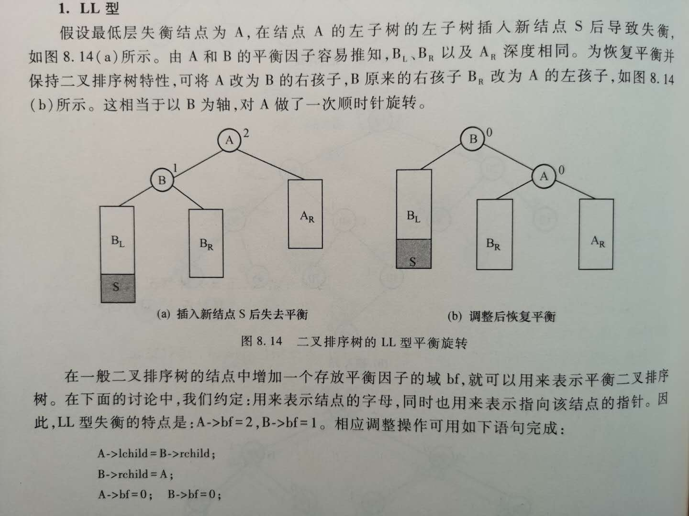
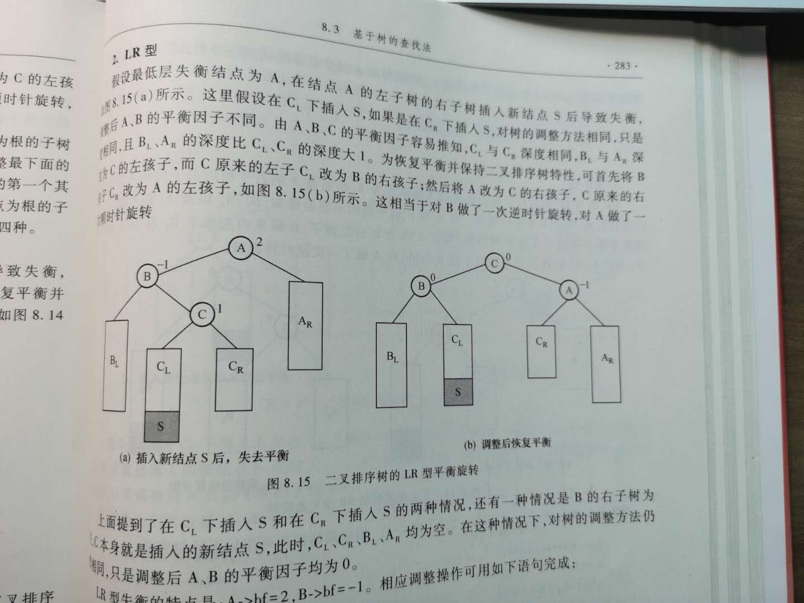
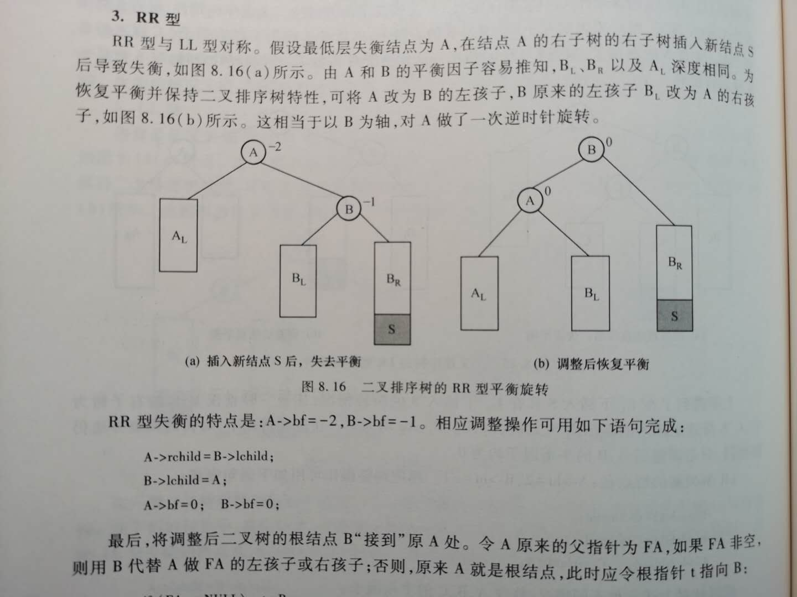
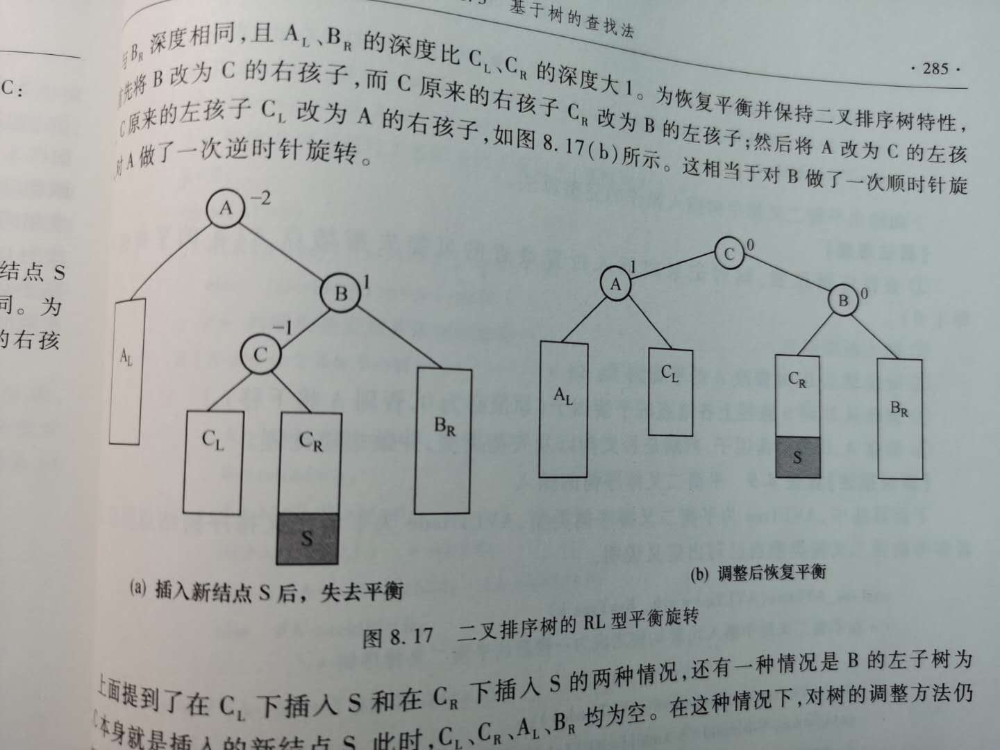

本周做一期关于平衡二叉树的总结

<!--more-->
---

平衡二叉树里有一个很重要的概念叫BF(Balance Factor)，这个值是由左子树的高度减去右子树的高度得到的。
当一棵树为平衡二叉树时，BF的取值为-1，0或者1.

---
# 总体的调整思路和调整的方法：
1. 确定失衡的类型。
2. 寻找失衡的结点。
3. 根据不同的类型和结点，确定调整方案。
4. 更新相应的类似于leftchild,rightchild,parent,bf的值。
---

# 失衡类型以及相应的调整：
## LL类型的失衡：


调整方式：
顺时针旋转下来，原来的根节点转换为现在根节点的右子树。以及一些相应的变换。
重点在于BF的值的调整：失衡的A,B结点的值全部转变为了0。

## LR类型的失衡：

调整方式:
左半边逆时针旋转，右半边顺时针旋转。处于LR上的结点变换为新的根节点。
重点也在于BF值的调整：原来根节点的的BF为-1，其余的BF都归0.

## RR类型的失衡：

调整方式：
逆时针旋转下来，原来的根节点调整为现在根节点的左子树。以及一些相应的变换。
重点在于BF的值的调整：失衡的A,B结点的值全部转变为了0。

## RL类型的失衡：

调整方式：
左半边向下旋转，右半边也向下旋转。处于RL结点上的结点转换为新的根节点。
重点也在于BF值的调整：原来根节点的的BF为1，其余的BF都归0.


# 对应的代码如下：
```
//我不是代码的生产者，我只是没有感情的代码搬运工。
#include <stdio.h>
#include <stdlib.h>

#define ENDKEY 0

typedef int KeyType;

typedef struct  node
{
   KeyType  key ; 
   struct node  *lchild,*rchild;
   int bf;	
}AVLTNode, *AVLTree;

void CreateAVLT(AVLTree *bst);
void ins_AVLtree(AVLTree *avlt, KeyType k);
void InOrder(AVLTree root);
AVLTNode *SearchAVLTree(AVLTree bst, KeyType k);
 
int main()
{
	AVLTree T;
	AVLTNode *node;
	KeyType i;
	
	printf("Now begin to create an AVLTree:\n");
    CreateAVLT(&T);
	printf("\nThe InOrder is:\n");
	InOrder(T);
	printf("\n\n");
	i = 53;
	node=SearchAVLTree(T,i);
	if (node)
	   printf("The node %d is found, its bf is %d\n\n",node->key,node->bf);
	else
	   printf("The node %d is not found\n\n",i);
 	   
	return 1;
}

void CreateAVLT(AVLTree *bst)
{ 
   KeyType key;
   *bst = NULL;
   printf("Please input the sequece to create an AVLTree\n");
   printf("For example: 45 24 53 12 28 90 0\n");  //p.272 eg.8.2
   scanf("%d", &key);
   while (key!=ENDKEY)  
   {
      ins_AVLtree(bst, key);
      scanf("%d", &key);
   }
}
// algorithm 8.9 
void ins_AVLtree(AVLTree *avlt, KeyType k)
{
   AVLTNode *S;
   AVLTNode *A,*FA,*p,*fp,*B,*C;
   
   S = (AVLTree)malloc(sizeof(AVLTNode));
   S->key = k; 
   S->lchild = S->rchild=NULL;
   S->bf = 0;
   if (*avlt==NULL)  
      *avlt = S;
   else 
   { 
   // locate A and the place for inserting S
   A = *avlt;  
   FA = NULL;
   p = *avlt;  
   fp = NULL;
   while (p!=NULL)
   { 
      if (p->bf!=0) 
      {
         A = p; 
		 FA = fp;
      }
      fp = p;
      if (k < p->key)  
         p = p->lchild;
      else  
         p = p->rchild;
   }
   // insert S
   if (k < fp->key) 
      fp->lchild = S;
   else
      fp->rchild = S;
   // Locate B and adjust the bf of A   
   if (k < A->key)
   {
      B = A->lchild;
      A->bf = A->bf+1;
   }
   else 
   {
      B = A->rchild;
      A->bf = A->bf-1;
   }
   // adjust the bf of the nodes from B to S
   p = B;
   while (p!=S)
      if (k < p->key)
      {
         p->bf = 1;
         p = p->lchild;
      }
      else
      {
         p->bf=-1;
         p=p->rchild;
      }
    // adjust the shape to keep balance  
   if (A->bf==2&&B->bf==1)   // LL类型失衡
   {
      B = A->lchild;
      A->lchild = B->rchild;
      B->rchild = A;
      A->bf = 0;
      B->bf = 0;
      if (FA==NULL) 
         *avlt = B;
      else 
         if (A==FA->lchild) 
            FA->lchild = B;
         else 
            FA->rchild = B;
   }
   else
      if (A->bf==2 && B->bf==-1)  // LR类型失衡
      {
         B = A->lchild;
	     C = B->rchild;
         B->rchild = C->lchild;
	 	 A->lchild = C->rchild;
	 	 C->lchild = B;
		 C->rchild = A;
		 if (S->key < C->key)
		 { 
		    A->bf = -1;
			B->bf = 0;
			C->bf = 0;
		 }
		 else 
            if (S->key >C->key)
		    {
               A->bf = 0;
			   B->bf = 1;
			   C->bf = 0;
		    }
		    else
		    { 
                A->bf = 0;
				B->bf=0;
			}
         if (FA==NULL) 
            *avlt = C;
		 else 
		    if (A==FA->lchild) 
			   FA->lchild = C;
			else 
			   FA->rchild = C;
			}
   else 
      if (A->bf==-2 && B->bf==1)  // RL类型失衡
	  {
         B = A->rchild;
		 C = B->lchild;
		 B->lchild = C->rchild;
		 A->rchild = C->lchild;
		 C->lchild = A;
		 C->rchild = B;
		 if (S->key <C->key) 
		 { 
            A->bf = 0;
			B->bf=-1;
			C->bf=0;
		 }
		 else 
		    if (S->key >C->key)
		    {
               A->bf = 1;
			   B->bf = 0;
			   C->bf = 0;
			}
			else 
			{ 
			   A->bf = 0;
			   B->bf = 0;
			}
         if (FA==NULL)  
		    *avlt = C;
		 else
 	        if (A==FA->lchild) 
		       FA->lchild = C;
			else  
			   FA->rchild=C;
			}
   else 
      if (A->bf==-2 && B->bf==-1)   // RR类型失衡
	  {
         B = A->rchild;
		 A->rchild = B->lchild;
		 B->lchild = A;
		 A->bf = 0;
		 B->bf = 0;
		 if (FA==NULL) 
		    *avlt = B;
		 else
            if (A==FA->lchild)
		       FA->lchild = B;
			else 
			   FA->rchild=B;
      }
   }
}

// InOrder 
void InOrder(AVLTree root)
{
   if (root != NULL)
   {
      InOrder(root->lchild);
      printf("%4d",root->key);     
      InOrder(root->rchild);   	
   }
}

AVLTNode *SearchAVLTree(AVLTree bst, KeyType k)
//一直往下查找就ok了嗷！
{ 
   AVLTNode *q;
   q = bst;
   while(q)
   {
      if (q->key == k) 
         return q;  
      if (q->key > k)  
         q = q->lchild;  
      else  
         q = q->rchild;  
   }
   return NULL; 
}


```
