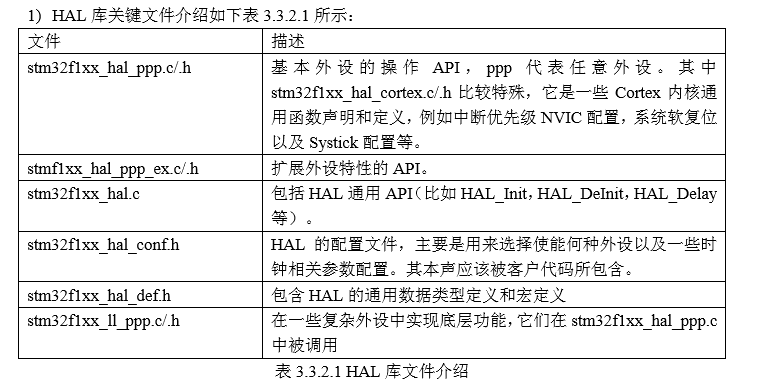

# 由于晚上自学kail和stm开发板真的难顶，小刘打算边自学边把学到的东西记在这里，方便日后的查找和复习。

---

<!--more-->

# 关于位运算和位操作：

## 如何进行位运算：GPIOx->BSRR = (((uint32_t)0x01) << pinpos); 这个操作就是将 BSRR 寄存器的第 pinpos 位设置为 1，为什么要通过左移而不是直接设 置一个固定的值呢？其实，这是为了提高代码的可读性以及可重用性。
&：按位与   |   ~：取反
|：按位或     |   <<: 左移
^: 按位异或  |   >>: 右移

北大位运算MOOC链接：
[北大MOOC第四章位运算](https://www.icourse163.org/learn/PKU-1001553023?tid=1206486203#/learn/content?type=detail&id=1211262497)

e.g.

    > GPIOA->CRL&=0XFFFFFF0F

CRL端口本身的位对应的值于0XFFFFFF0F(0:0000;F:1111,每一个数字代表二进制中的四个位置，总共32位)
表示将端口的第4~7位清零。

e.g.

    > GPIOA->CRL|=0X00000040; //设置相应位的值，不改变其他位的值    
或操作保证了其余的位置全部为原来的值，对应的四位改为相应的值，具体怎么操作怎么改要根据端口的数据来看。

## 位运算如何提高代码的可读性：

    > GPIOx->BSRR = (((uint32_t)0x01) << pinpos); 
这个操作就是将 BSRR 寄存器的第 pinpos 位设置为 1，为什么要通过左移而不是直接设 置一个固定的值呢？
其实，这是为了提高代码的可读性以及可重用性。

这样的作法设置第 3 位为 0，但是这样的作法同样不好看，并且可读性很差。
看看库函数 代码中怎样使用的： TIMx->SR = (uint16_t)~TIM_FLAG; 
而 TIM_FLAG 是通过宏定义定义的值：
 
    > #define TIM_FLAG_Update                    ((uint16_t)0x0001)
    > #define TIM_FLAG_CC1                         ((uint16_t)0x0002) 

看这个应该很容易明白，可以直接从宏定义中看出 TIM_FLAG_Update 就是设置的第 0 位了， 可读性非常强。 

# 一些常用的HAL库的东东：

